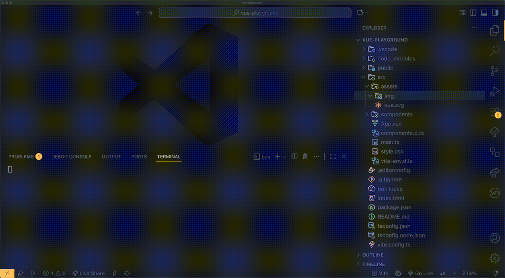

# 🖼️ Vite Convert Images 
A Vite plugin that automatically converts your raster images into modern formats and responsive variants — with zero hassle.


<sub>Added 3 image and 2 more 1 seconds later</sub>

## ✨ Features
#### 🪄 **Automatic Downscaling**
If you include high-density assets like `image@2x.png` or `image@3x.jpg`, the plugin will:
- Generate scaled variants (`@3x → @2x → @1x`, `@2x → @1x`,  depending on max scale).
- Convert each version to `WebP` and `AVIF` formats.

#### 🖼️ **LQIP (Low Quality Image Placeholder) Generation**
Creates a tiny blurred webp thumbnail perfect for lazy-loading or progressive image effects.

#### ⚡ **Parallel Image Processing**
Handles multiple images in parallel for maximum performance.

#### 🧠 **Zero-config & Easy to Use**

Install, enable, and enjoy optimized images instantly.

## 📦 Installation
```bash
npm install vite-convert-images --save-dev
```

## Usage
```ts
// vite.config.ts
import { defineConfig } from 'vite'
import viteConvertImages from 'vite-convert-images'

export default defineConfig({
  plugins: [
    viteConvertImages()
  ]
})
```
If you save your image in `assets` folder it will generate all the conversions

**❗️Importnat Note**

Images name must be end with `@2x`, `@3x`, `@4x` etc. because the conversions count depends on this number.

For example
| Input File         | Generated Assets                                         |
| ------------------ | -------------------------------------------------------- |
| `hero@3x.png`      | `hero@3x.webp`, `hero@3x.avif`, `hero@2x.*`, `hero@1x.*`, `hero@lqip.web` |
| `icon@2x.png`      | `icon@2x.webp`, `icon@2x.avif`, `icon@1x.*`, `icon@lqip.webp`              |

## ⚙️ Config options

### `assetsDir`
Assets directory path
- Type: `string`
- Default `"/src/assets"`

### `formats`
Image formats to convert to
- Type: `ImageFormat[]`
- Default `['avif', 'webp']`

### `formatOptions`
Options for each format. This plugin using [`Sharp`](https://sharp.pixelplumbing.com/) behind the scene. Check the documentation for more detail about the different output options.

- `avif`
	- Type: [`AvifOptions`](https://sharp.pixelplumbing.com/api-output/#avif)
	- Default 
	```ts
	{
		quality: 70,
		effort: 4,
		chromaSubsampling: '4:2:0'
	}
	```
- `webp`
	- Type: [`WebpOptions`](https://sharp.pixelplumbing.com/api-output/#webp)
	```ts
	{
		quality: 90,
		effort: 4,
		smartSubsample: true,
		nearLossless: false,
	}
	```
- `jpg`
	- Type: [`JpegOptions`](https://sharp.pixelplumbing.com/api-output/#jpeg)
	- Default `Sharp default`
- `png`
	- Type: [`PngOptions`](https://sharp.pixelplumbing.com/api-output/#png)
	- Default `Sharp default`

### `removableExtensions`
Remove files with these extensions when the conversion finishes
- Type: `ImageFormat[]`
- Default `[]`

### `batchSize`
Number of concurrent image processing tasks
- Type `number`
- Default `4`

### `enableScaledVariants`
Generate scaled variants based on the highest-resolution image
- Type `boolean`
- Default `true`

### `enableLogs`
Log generated files to the console
- Type `boolean`
- Default `false`


## 🕓 Development-Only Behavior

`vite-convert-images` uses Vite’s `watchChange`
 hook to detect when image files are added, modified or removed.
This means:

- 🧩 Image conversion runs only while the Vite dev server is active.

- ⚡ It processes new or updated images on the fly — no need to restart the server.

This approach ensures that the plugin:

- Doesn’t slow down your production builds

- Keeps development feedback loops instant and responsive

- Provides a live, automatic image pipeline while you work

## 🚀 Why Use This?
Modern web performance starts with images. `vite-convert-images` helps you ship smaller, smarter, and future-proof image assets without any manual work.

- **Reduced bundle size** — WebP and AVIF can be 50–80% smaller than PNG/JPEG.
- **Responsive ready** — Automatically generate variants for different screens.
- **Progressive loading UX** — Built-in LQIP means images load gracefully with blur previews.
- **Developer-friendly workflow** — Just drop your assets in and the plugin handles the rest.
- **Optimized for modern browsers** — Seamlessly deliver next-gen formats with fallback support.

## 📚 Resources
- https://web.dev/learn/performance/image-performance
- https://www.smashingmagazine.com/2021/09/modern-image-formats-avif-webp
- https://caniuse.com/webp
- https://caniuse.com/avif

## 📄 License <span name="license"></span>

MIT License © 2025 [feat.](https://feat.agency)
