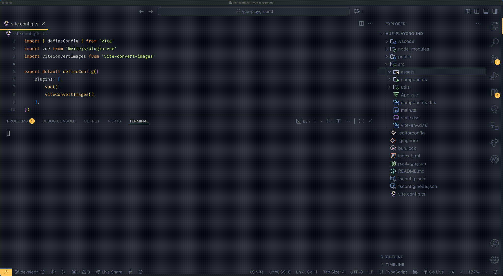

---
# https://vitepress.dev/reference/default-theme-home-page
layout: home

hero:
  name: "Vite Convert Images"
  text: Automatic responsive image conversion for modern web projects
  tagline: Generate WebP, AVIF, scaled variants, and LQIP placeholders — instantly while you develop.
  align: center
  actions:
    - theme: brand
      text: Get Started
      link: /guide/getting-started
    - theme: alt
      text: View on GitHub
      link: https://github.com/mateenagy/vite-convert-images

features:
  - icon: ⚡
    title: Fast & Parallel
    details: Converts multiple images at once using efficient parallel processing — built for speed.
  - icon: 🪄
    title: Automatic Scaling
    details: Generates scaled variants based on your highest-resolution image automatically.
  - icon: 🖼️
    title: Modern Formats
    details: Outputs WebP and AVIF images alongside your originals for smaller, sharper assets.
  - icon: 🌫️
    title: LQIP Support
    details: Creates lightweight blurred placeholders (webp) for smooth lazy-loading effects.
  - icon: 🧩
    title: Dev Server Integration
    details: Uses Vite’s watchChange hook — runs only in dev mode when the server is active.
  - icon: 💡
    title: Easy to Use
    details: Just install, drop in your images, and let the plugin handle conversions automatically.
---

## Why Responsive Images Matter

Modern websites rely heavily on visuals — and images are often the largest performance bottleneck.  
`vite-convert-images` solves this by integrating image optimization **directly into your Vite dev pipeline**.

- 🚀 **Smaller bundle size** → AVIF & WebP compress better than PNG/JPEG.  
- 🧠 **Responsive-ready** → Serves scaled variants automatically.  
- 🌍 **Better UX & SEO** → Faster load times improve Core Web Vitals and engagement.  
- 🪶 **Progressive loading** → Built-in LQIP makes your images fade in smoothly.  
- ⚙️ **No manual work** → Just keep your design workflow; let Vite handle the rest.
